# ¡Hola! Soy Pablo García María 👋

### 🚀 Sobre mí
 Soy un **Desarrollador Full Stack Junior** apasionado por la creación de soluciones eficientes y la automatización de procesos. Actualmente, estoy cursando el ciclo de **Desarrollo de Aplicaciones Multiplataforma (DAM)** en Salesianos San Pedro.

Me especializo en el ecosistema **Java/Spring** , aunque tengo algo de experiencia real integrando APIs (Prestashop, Holded) y gestionando despliegues en servidores con **PHP/Laravel**.

- 🎓 **Estudiando:** Grado Superior en Desarrollo de Aplicaciones Multiplataforma.
- 🛠️ **Experiencia reciente:** Desarrollo de aplicaciones web y automatización con Python en Ceroone.
- 🌍 **Idiomas:** Español nativo e Inglés.
- 📍 **Ubicación:** Sevilla, España.

---

### 🛠️ Tecnologías y Herramientas

| Categoría | Herramientas |
| :--- | :--- |
| **Backend** |      |
| **Frontend** |     |
| **Bases de Datos** |    |
| **DevOps & Herramientas** |    |

---

### 📊 Mis Estadísticas

---

### 📫 Conecta | Contacta conmigo
- LinkedIn: [Pablo Garcia Maria](https://www.linkedin.com/in/pablo-garcia-maria-0020b52b1)
- Wakatime: [KuroFG](https://wakatime.com/@KuroFG)
- Email: pgarmar230@gmail.com